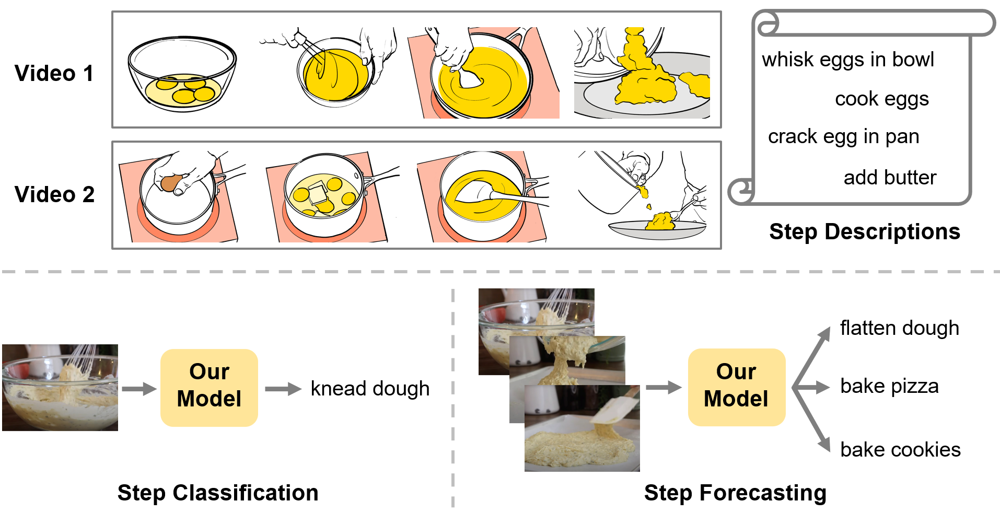
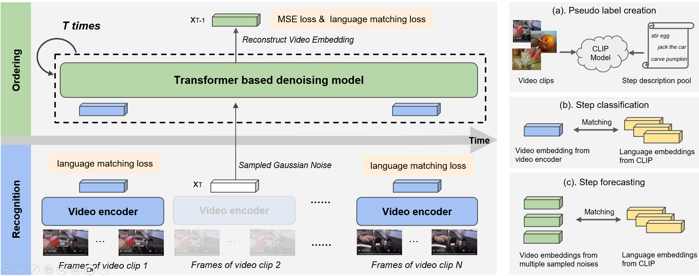

# Learning Procedure-aware Video Representation from Instructional Videos and Their Narrations

This is the official PyTorch implementation of ProcedureVRL (CVPR 2023).

[**Paper**](https://arxiv.org/abs/2303.17839) | [**Slides**](https://drive.google.com/file/d/18Cqj4-hdqXhKFZ-OVfkFIfm_fdhcKkWD/view?usp=sharing) | [**Poster**](https://drive.google.com/file/d/1CGe01HxeLNg5NAk2F18vswaqUu0Aas26/view?usp=sharing)

> **Learning Procedure-aware Video Representation from Instructional Videos and Their Narrations** <br>
> [Yiwu Zhong](https://pages.cs.wisc.edu/~yiwuzhong/), [Licheng Yu](https://lichengunc.github.io/), Yang Bai, Shangwen Li, Xueting Yan<sup>#</sup>, and [Yin Li](https://www.biostat.wisc.edu/~yli/)<sup>#</sup> <br>
> (<sup>#</sup>co-corresponding authors)<br>
> **CVPR 2023**<br>

<p align="center">

</p>

## Overview

We propose a video-and-language pretraining framework for learning **procedure-aware** video representation from a large-scale dataset of instructional videos and their narrations, without the need for human annotations. Our method jointly learns **a video encoder** that captures concepts of action steps, as well as **a diffusion model** that reasons about the temporal dependencies among steps. The resulting representations establish **new state-of-the-art** results on both step classification and forecasting tasks across the major benchmarks. Besides, our model supports **zero-shot inference** and is capable of generating **diverse step predictions**.

- **Pretraining**: Our model learns video representations that encode both action steps and their temporal ordering from large-scale unannotated instructional videos.
- **Zero-shot inference**: Once pretrained, the learned video representations support zero-shot step classification and zero-shot step forecasting (**first work**), yielding **multiple credible predictions**.
- **Finetuning**: Our pretrained model can be further fine-tuned with additional human annotations of target tasks, such as step classification and step forecasting.
- **Results**: Our method demonstrates **state-of-the-art** results on step classification and step forecasting in both zero-shot and fine-tuning settings and across COIN and EPIC-Kitchens-100 datasets.


<p align="center">

</p>


## Updates
* [06/19/2023] We released models, training code, and evaluation code for our ProcedureVRL!

## Outline

1. [Installation](#Installation)
2. [Datasets](#Datasets)
3. [Model Zoo](#Model-Zoo)
4. [Pretraining](#Pretraining)
5. [Zero-shot Inference](#Zero-shot-Inference)
6. [Finetuning](#Finetuning)
7. [Finetuning Evaluation](#Finetuning-Evaluation)
8. [License and Contributing](#License-and-Contributing)
9. [Citation and Acknowledgement](#Citation-and-Acknowledgement)


## Installation
Check [INSTALL.md](INSTALL.md) for installation instructions and environment information.


## Datasets

Please use the dataset preparation instructions provided in [DATASET.md](DATASET.md).


## Model Zoo

All trained models can be downloaded from this [Google Drive](https://drive.google.com/drive/folders/1Qg3qCjDNRnuFNdRNQbocfLnrzwTosCN1?usp=drive_link). Please put the downloaded folders in `./exps` directory. Each downloaded folder contains a trained model checkpoint that was saved in a `.pyth` file (e.g., our model pretrained on HowTo100M is saved at `./exps/procedurevrl-stg2/checkpoints/checkpoint_epoch_00025.pyth`).

We provide our model pretrained on **HowTo100M** dataset with **TimeSformer** architecture for our video encoder ([download link](https://drive.google.com/drive/folders/1j20nI7Nq8qfZTHTk7cFpcZUWPOlXU_PD?usp=drive_link)). This model achieves **new state-of-the-art** results in both **zero-shot** and **finetuning** settings across following benchmarks where **NA** suggusts that the model doesn't support such ability:

**Step forecasting** on COIN dataset:

| Model | Pretraining Supervision | Pretraining Dataset | Zero-shot (%) | Finetuning (%) |
| --- | --- | --- | --- | --- |
| Previous SoTA | Unsupervised: ASR + wikiHow | HowTo100M | NA | 39.4 |
| Ours | Unsupervised: ASR | HowTo100M | **11.3** | **46.8** |

**Step classification** on COIN dataset:

| Model | Pretraining Supervision | Pretraining Dataset | Zero-shot (%) | Finetuning (%) |
| --- | --- | --- | --- | --- |
| Previous SoTA | Unsupervised: ASR + wikiHow | HowTo100M | NA | 54.1 |
| Ours | Unsupervised: ASR | HowTo100M | **16.6** | **56.9** |

**Procedural activity classification** on COIN dataset:

| Model | Pretraining Supervision | Pretraining Dataset | Finetuning (%) |
| --- | --- | --- | --- |
| Previous SoTA | Unsupervised: ASR + wikiHow | HowTo100M | 88.9 |
| Ours | Unsupervised: ASR | HowTo100M | **90.8** |

**Egocentric action recognition** on EPIC-Kitchens-100 dataset:

| Model | Pretraining Supervision | Pretraining Dataset | Verb (%) | Verb (%) | Noun (%) |
| --- | --- | --- | --- | --- | --- |
| MoViNet |  -- | -- | **47.7** | **72.2** | 57.3 |
| DistantSup |  Unsupervised: ASR + wikiHow | HowTo100M | 44.4 | 67.1 | 58.1 |
| Ours | Unsupervised: ASR | HowTo100M  | **47.7** | 69.5 | **60.3** |

**Note** that both DistantSup and Ours adopt TimeSformer as encoder backbone while MoViNet itself is a heavily optimized video backbone.

For future use, we also provide our model pretrained on **HowTo100M** dataset with **MViT-v2** architecture for our video encoder ([download link](https://drive.google.com/drive/folders/1wf4QNY0o7T82zRP9a-6D3pjJHlaoKgP4?usp=drive_link)). We test pretrained models on COIN dataset with **zero-shot setting**:

| Model | Pretraining Supervision | Pretraining Dataset | Classification (%) | Forecasting (%) |
| --- | --- | --- | --- | --- |
| Ours (TimeSformer) | Unsupervised: ASR | HowTo100M | **16.6** | **11.3** |
| Ours (MViT-v2-S)   | Unsupervised: ASR | HowTo100M |   12.5   |    9.0   |

We conjecture that TimeSformer, which samples 8 frames from consecutive 256 frames, is better suited for recognizing actions with long durations, such as COIN steps. Conversely, MViT-S, which samples 16 frames from consecutive 96 frames, may perform better for recognizing actions with short durations and high-speed motion.


## Pretraining

We pretrain our model on the unannotated videos from the Howto100M dataset. Please refer to [DATASET.md](DATASET.md) to ensure that you have already prepared the data and filled the fields in config yaml files. Our pretraining consists of two stages: stage one using SGD for 5 epochs and stage two using Adamw for 25 epochs. 

We provide pretraining scripts for **single-node training** and **multi-node distributed training (recommended)**.

<details>
<summary>
Single-node training: If you have only one compute node (e.g., a local computer), then you can run the following command.
</summary>

```
# pretraining: stage 1
python tools/run_net.py \
--cfg configs/HowTo100M/procedurevrl_sgd.yaml \
OUTPUT_DIR exps/procedurevrl-stg1/ \
NUM_SHARDS 1 \
NUM_GPUS 8 

# pretraining: stage 2
python tools/run_net.py \
--cfg configs/HowTo100M/procedurevrl_adamw.yaml \
OUTPUT_DIR exps/procedurevrl-stg2/ \
NUM_SHARDS 1 \
NUM_GPUS 8 \
TIMESFORMER.PRETRAINED_MODEL exps/procedurevrl-stg1/checkpoints/checkpoint_epoch_00005.pyth
```
</details>

<details>
<summary>
Multi-node distributed training: If you have multiple compute nodes (e.g., a cluster with Slurm), then you can run the following command using submitit.
</summary>

```
# pretraining: stage 1
JOB_NAME=procedurevrl-stg1
python tools/submit.py \
--cfg configs/HowTo100M/procedurevrl_sgd.yaml \
--name ${JOB_NAME} \
--job_dir ./exps/${JOB_NAME}/  \
--partition YOUR_PARTITION_NAME \
--num_shards 8 \
--num_gpus 8 \

# pretraining: stage 2
JOB_NAME=procedurevrl-stg2
python tools/submit.py \
--cfg configs/HowTo100M/procedurevrl_adamw.yaml \
--name ${JOB_NAME} \
--job_dir ./exps/${JOB_NAME}/  \
--partition YOUR_PARTITION_NAME \
--num_shards 8 \
--num_gpus 8 \
TIMESFORMER.PRETRAINED_MODEL exps/procedurevrl-stg1/checkpoints/checkpoint_epoch_00005.pyth \
```

`--partition` is the partition name in your cluster. `--num_shards` specifies how many nodes to run on. `--num_gpus` represents the number of GPUs on each node. 
</details>


If you would like to run pretraining on the HowTo100M subset, set `DATA.PATH_TO_DATA_DIR` to `./data_csv/howto100m_subset/`.

If you would like to use MViT-v2 architecture for video encoder (default is TimeSformer), set `--cfg` to MViT-v2 config files accordingly (`procedurevrl_mvitv2_sgd.yaml`, `procedurevrl_mvitv2_adamw.yaml`).

## Zero-shot Inference

After pretraining, our model is capable of zero-shot inference for both step classification and step forecasting. This is done by matching the video representation with language embeddings of step candidates, such as the extracted video features from the video encoder (step classification), and the reconstructed video features from the diffusion model (step forecasting).

We test our pretrained model on COIN dataset. Please refer to [DATASET.md](DATASET.md) to ensure that you have already prepared the data and filled the fields in config yaml files.

<details>
<summary>
Zero-shot step classification
</summary>

```
python tools/run_net.py \
--cfg configs/COIN/step_classification.yaml \
OUTPUT_DIR exps/zs_coin_cls \
NUM_SHARDS 1 \
NUM_GPUS 8 \
TRAIN.ENABLE False \
DEV.MATCH_LANG_EMB True \
TIMESFORMER.PRETRAINED_MODEL exps/procedurevrl-stg2/checkpoints/checkpoint_epoch_00025.pyth \
```
</details>

<details>
<summary>
Zero-shot step forecasting
</summary>
  
```
python tools/run_net.py \
--cfg configs/COIN/step_forecasting.yaml \
OUTPUT_DIR exps/zs_coin_fcst \
NUM_SHARDS 1 \
NUM_GPUS 8 \
TRAIN.ENABLE False \
DEV.MATCH_LANG_EMB True \
TEST.NUM_ENSEMBLE_VIEWS 1 \
TIMESFORMER.PRETRAINED_MODEL exps/procedurevrl-stg2/checkpoints/checkpoint_epoch_00025.pyth \
```
</details>

**Note** that `TIMESFORMER.PRETRAINED_MODEL` should point to the correct folder where your pretrained model locate.

## Finetuning

After pretraining, our model can be further finetuned with additional human annotations. For more details on finetuning setting, please refer to our paper.

We provide finetuning scripts for COIN and EPIC-Kitchens-100 datasets. Please refer to [DATASET.md](DATASET.md) to ensure that you have already prepared the data and filled the fields in config yaml files.

<details>
<summary>
Step classification on COIN
</summary>

```
JOB_NAME=procedurevrl-coin-cls
python tools/submit.py \
--cfg configs/COIN/step_classification.yaml \
--name ${JOB_NAME} \
--job_dir ./exps/${JOB_NAME}/  \
--partition YOUR_PARTITION_NAME \
--num_shards 4 \
--num_gpus 8 \
TIMESFORMER.PRETRAINED_MODEL exps/procedurevrl-stg2/checkpoints/checkpoint_epoch_00025.pyth \
```
</details>


<details>
<summary>
Step forecasting on COIN
</summary>

```
JOB_NAME=procedurevrl-coin-fcst
python tools/submit.py \
--cfg configs/COIN/step_forecasting.yaml \
--name ${JOB_NAME} \
--job_dir ./exps/${JOB_NAME}/  \
--partition YOUR_PARTITION_NAME \
--num_shards 4 \
--num_gpus 8 \
TIMESFORMER.PRETRAINED_MODEL exps/procedurevrl-stg2/checkpoints/checkpoint_epoch_00025.pyth \
```

</details>


<details>
<summary>
Procedural activity classification on COIN
</summary>

```
JOB_NAME=procedurevrl-coin-taskcls
python tools/submit.py \
--cfg configs/COIN/task_classification.yaml \
--name ${JOB_NAME} \
--job_dir ./exps/${JOB_NAME}/  \
--partition YOUR_PARTITION_NAME \
--num_shards 4 \
--num_gpus 8 \
TIMESFORMER.PRETRAINED_MODEL exps/procedurevrl-stg2/checkpoints/checkpoint_epoch_00025.pyth \
```

</details>


<details>
<summary>
Action recognition on EPIC-Kitchens-100
</summary>

```
JOB_NAME=procedurevrl-ek-cls
python tools/submit.py \
--cfg configs/EK/egocentric_action_classification.yaml \
--name ${JOB_NAME} \
--job_dir ./exps/${JOB_NAME}/  \
--partition YOUR_PARTITION_NAME \
--num_shards 4 \
--num_gpus 8 \
TIMESFORMER.PRETRAINED_MODEL exps/procedurevrl-stg2/checkpoints/checkpoint_epoch_00025.pyth \
```
</details>

**Note** that `TIMESFORMER.PRETRAINED_MODEL` should point to the correct folder where your pretrained model locate.


## Finetuning Evaluation

To evaluate the finetuned models, you can either run on multi nodes (re-use finetuning scripts by additionally setting `TRAIN.ENABLE` to `False`), or run on a single node (re-use zero-shot inference scripts by additionally setting `DEV.MATCH_LANG_EMB` to `False`).

**Note** that `TIMESFORMER.PRETRAINED_MODEL` should point to the correct folder where your finetuned model locate.

## License and Contributing

The majority of this work is licensed under [CC-BY-NC-SA 3.0](LICENSE). However, portions of the project are available under separate license terms: [SlowFast](https://github.com/facebookresearch/SlowFast) and [pytorch-image-models](https://github.com/rwightman/pytorch-image-models) are licensed under the Apache 2.0 license.

We actively welcome your pull requests. Please see [CONTRIBUTING.md](CONTRIBUTING.md) and [CODE_OF_CONDUCT.md](CODE_OF_CONDUCT.md) for more info.


## Citation and Acknowledgement

This repo is built on top of a series of codebases, including [Distant Supervision](https://github.com/facebookresearch/video-distant-supervision), [TimeSformer](https://github.com/facebookresearch/TimeSformer), [PySlowFast](https://github.com/facebookresearch/SlowFast) and [pytorch-image-models](https://github.com/rwightman/pytorch-image-models). Our EPIC-Kitchen dataloader is partially borrowed from [Motionformer](https://github.com/facebookresearch/Motionformer). We parse the verb phrases from ASR sentences by using the scripts provided by [VisualNarrationProceL](https://github.com/Yuhan-Shen/VisualNarrationProceL-CVPR21). Our transformer architecture partially refers to [CLIP](https://github.com/openai/CLIP). We thank all authors for releasing their code.

If you find this repo useful, please consider citing our paper:
```BibTeX
@inproceedings{zhong2023learning,
  title={Learning Procedure-aware Video Representation from Instructional Videos and Their Narrations},
  author={Zhong, Yiwu and Yu, Licheng and Bai, Yang and Li, Shangwen and Yan, Xueting and Li, Yin},
  booktitle={Proceedings of the IEEE/CVF Conference on Computer Vision and Pattern Recognition},
  pages={14825--14835},
  year={2023}
}
```
